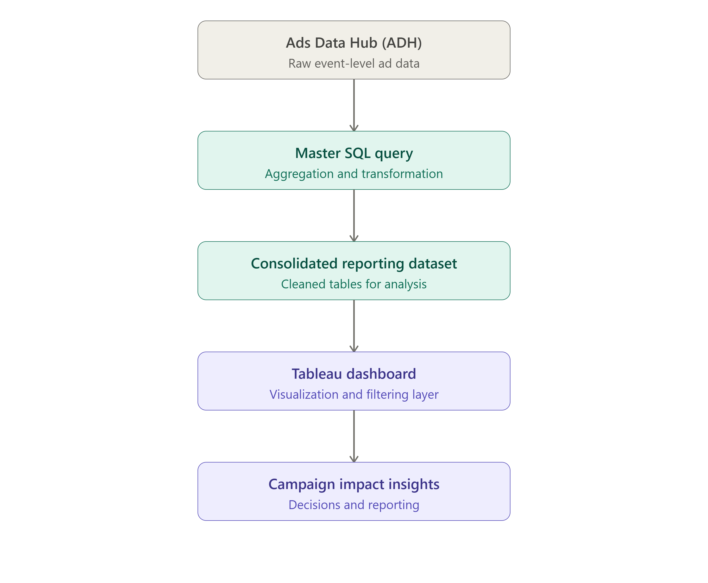

# campaign-impact-analytics-solution
End-to-end campaign impact analytics solution built using ADH, SQL, Tableau, and Figma to measure brand lift and audience impact.
# Brand Lift Measurement & Insights Dashboard
Overview
Developed an end-to-end analytics solution to measure campaign impact using exposed and control audience survey responses.
The solution automates data preparation, enables dynamic audience comparison, and provides actionable insights through an interactive Tableau dashboard.
Consolidated multiple reporting outputs into a single workflow, reducing repetitive processing and improving reporting efficiency.

# Business Problem
Campaign measurement reporting required multiple manual data extraction and transformation steps before analysis.
The objective was to create a scalable reporting solution capable of:
- Measuring campaign impact
- Comparing exposed and control audiences
- Analyzing performance across audience segments
- Reducing manual reporting effort
# Solution
Designed and developed a reporting workflow consisting of:
- SQL-based data preparation
- Automated output generation
- Dynamic dashboard interactions
- Parameter-driven comparisons
- Executive-ready visualization design
# Key Features
Data Engineering
- Developed a centralized data preparation workflow that consolidated multiple reporting outputs into a single execution, reducing repetitive processing and improving reporting efficiency.
- Standardized reporting structure for dashboard consumption
- Reduced repetitive query execution

Tableau Development
- Interactive parameter selection
- Dynamic calculations
- Custom KPI metrics
- Brand lift calculations

Dashboard Design
- Designed dashboard layout using Figma
- Applied business-focused information hierarchy
- Optimized executive reporting experience

Tools Used
- SQL
- Tableau Desktop
- Tableau Public
- Figma
- Excel

# Data Privacy
All brands, platforms, markets, and business identifiers have been anonymized. Data values have been modified for portfolio demonstration purposes.

Data was sourced from Ads Data Hub (ADH), transformed through a centralized SQL-based data preparation workflow, and visualized in Tableau using custom calculations, parameters, and interactive dashboard components.

## My Contributions

- Designed dashboard wireframes using Figma
- Developed an automated reporting workflow
- Built a master SQL query to consolidate multiple reporting outputs
- Created parameter-driven analysis in Tableau
- Developed custom calculated fields and KPI logic
- Designed an executive-friendly dashboard experience

## Skills Demonstrated

- Tableau
- SQL
- Ads Data Hub (ADH)
- Dashboard Design
- Data Visualization
- Reporting Automation
- Business Analytics

## Solution Architecture

## Live Dashboard

View the dashboard on Tableau Public:

[View Dashboard](PASTE_LINK_HERE)

